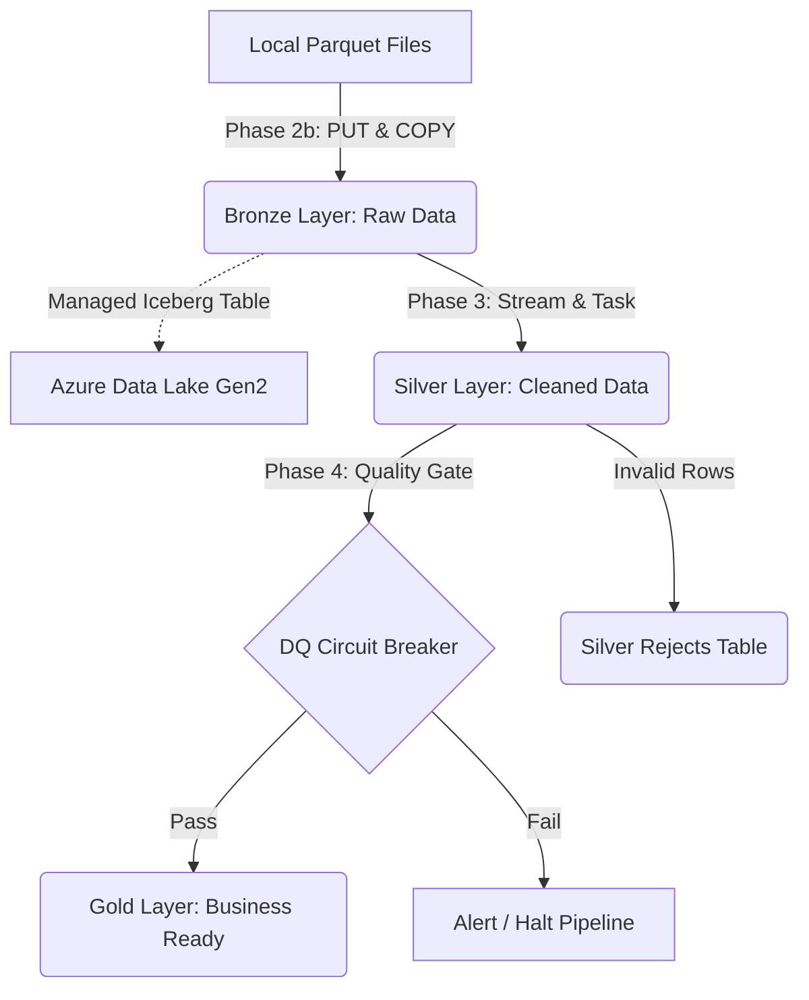

# Medallion Lakehouse on Snowflake (Azure Edition)

This project contains the SQL scripts necessary to deploy a Medallion Lakehouse architecture on Snowflake, backed by Azure Data Lake Storage Gen2.

All executable code is isolated in the `src/scripts/` directory so you can easily run them using your local Snowflake CLI (e.g., `snow sql -f src/scripts/00_database_setup.sql`).

## Repository Structure

```text
Medallion_Lakehouse_on_Snowflake/
├── README.md                           # Project documentation and architecture
├── docs/                               # Any additional documentation or diagrams
└── src/
    └── scripts/                        # Executable Snowflake SQL scripts
        ├── 00_database_setup.sql       # Creates DB, schema, and compute warehouses
        ├── 01_storage_setup.sql        # Azure Blob Storage external volume integration
        ├── 02_bronze_layer.sql         # Iceberg Table & Stream creation
        ├── 02b_load_data.sql           # Ingests raw Parquet files via staging
        ├── 03_silver_layer.sql         # Silver stored procedure & task (Cleansing)
        ├── 04_quality_control.sql      # Circuit breaker task for bad data
        ├── 05_gold_layer.sql           # Aggregation task for Business Intelligence
        ├── 06_automation.sql           # Starts the automated task DAG
        ├── 07_monitoring.sql           # Queries to check pipeline health
        └── 08_trigger_pipeline.sql     # Force-triggers the pipeline manually
```

## Project Architecture & Data Flow

This project implements a **Medallion Architecture** using Snowflake and Azure Data Lake Storage Gen2. Data flows sequentially through three conceptual layers:



1. **Bronze Layer (Landing Zone)**: Raw Parquet data is ingested into a Snowflake-managed Iceberg Table (`bronze_trips`). This table stores its data files directly in your Azure Data Lake container, giving you the best of cloud storage pricing with Snowflake's compute. A Snowflake Stream watches this table for any newly arrived records.
2. **Silver Layer (Cleaning Zone)**: A scheduled Snowflake Task (`silver_trips_task`) wakes up every 10 minutes. If the Bronze stream has new data, the task springs into action. It routes bad data (like negative fares or impossible timestamps) into a `silver_rejects` table, and cleanly merges the good data into the `silver_trips` table.
3. **Quality Control (The Gate)**: The `dq_gate_task` runs immediately after the Silver layer finishes. It calculates the percentage of rows that were rejected. If the error rate is too high (e.g., > 2%), it acts as a "circuit breaker" and intentionally halts the pipeline to prevent garbage data from reaching business reports.
4. **Gold Layer (Business Zone)**: If the quality gate passes, the `gold_daily_driver_earnings_task` runs. It aggregates the cleaned Silver data into a highly summarized `gold_daily_driver_earnings` table, which is optimized for extremely fast Business Intelligence dashboards and analyst queries.

## Deployment Steps

### Phase 0: Initial Database, Schema, & Warehouse Setup
* **File:** `src/scripts/00_database_setup.sql`
* **What it is:** Creates the `RIDEFLOW` database (the main filing cabinet), the `MEDALLION` schema (the specific drawer for this project), and the compute engines (`ETL_WH` and `BI_WH`).
* **Why it is used:** Before creating tables, Snowflake needs a dedicated location to store them.
* **Action:** Run the script from your terminal:
  ```bash
  snow sql -f src/scripts/00_database_setup.sql
  ```

### Phase 1: Storage Setup (Azure Data Lake)
* **File:** `src/scripts/01_storage_setup.sql`
* **What it is:** Connects Snowflake to your Azure Data Lake Storage Gen2 container.
* **Why it is used:** Iceberg tables need an external location to store data files. Connecting Snowflake to Azure lets you keep your data in your own cloud storage while using Snowflake's compute power.
* **Action:** 
  1. Open the SQL file and replace the placeholders with your actual details.
  2. Run the script:
     ```bash
     snow sql -f src/scripts/01_storage_setup.sql
     ```
  3. Get the connection details from Snowflake:
     ```bash
     snow sql -q "DESC EXTERNAL VOLUME rideflow_vol_azure;"
     ```
  4. From the output, copy the **`AZURE_CONSENT_URL`**.
  5. **Crucial Step:** Paste the URL into your browser, but append `&prompt=admin_consent` to the very end of it. This forces Azure to ask for organization-wide consent. Log in as an Azure Administrator and click **Accept**.
  6. Go to **Microsoft Entra ID** -> **Enterprise Applications** in the Azure Portal. Search for the app name (from `AZURE_MULTI_TENANT_APP_NAME`) and copy its **Object ID**.
  7. Navigate to your **Storage Account** -> **Access Control (IAM)** -> **Add role assignment**.
  8. Select exactly the **Storage Blob Data Contributor** role. Click **+ Select Members**, paste the **Object ID**, select the app, and click **Review + assign**.
  9. Wait 1 to 2 minutes, then verify the connection:
     ```bash
     snow sql -q "SELECT SYSTEM\$VERIFY_EXTERNAL_VOLUME('rideflow_vol_azure');"
     ```
     *(Note the escaped `\$` for bash!)*

### Phase 2: The Raw Data (Bronze Layer)
* **File:** `src/scripts/02_bronze_layer.sql`
* **What it is:** Creates the "Bronze" layer (the first landing zone) and a data stream.
* **Why it is used:** It acts as an exact historical record of raw data exactly as it arrives, so you can always rewind if needed.
* **Action:** Run the script:
  ```bash
  snow sql -f src/scripts/02_bronze_layer.sql
  ```

### Phase 2b: Table Creation & Data Loading
* **File:** `src/scripts/02b_load_data.sql`
* **What it is:** Creates the missing Silver/Gold tables and uploads your local `.parquet` data directly into the Bronze Azure Iceberg table.
* **Why it is used:** Iceberg tables managed by Snowflake must be written to *through* Snowflake. This script uploads your local WSL files into Snowflake, which then seamlessly writes them down into your Azure container.
* **Action:** Run the script from WSL:
  ```bash
  snow sql -f src/scripts/02b_load_data.sql
  ```

### Phase 3: Data Cleaning (Silver Layer)
* **File:** `src/scripts/03_silver_layer.sql`
* **What it is:** Creates a task that takes data from Bronze, cleans it, removes duplicates, and flags bad data to a "rejects" table.
* **Why it is used:** To ensure only trustworthy data moves forward. Rejecting bad data separately helps engineers investigate issues without losing data.
* **Action:** Run the script.

### Phase 4: Quality Control (The Gate)
* **File:** `src/scripts/04_quality_control.sql`
* **What it is:** A safety check task that calculates the percentage of rejected data.
* **Why it is used:** Acts as a "circuit breaker" that stops the pipeline if too much garbage data arrives, preventing it from polluting business reports.
* **Action:** Run the script.

### Phase 5: Business Intelligence (Gold Layer)
* **File:** `src/scripts/05_gold_layer.sql`
* **What it is:** Creates tables aggregated specifically to answer business questions.
* **Why it is used:** Makes data extremely fast and easy for business analysts/BI tools to query without writing complex SQL.
* **Action:** Run the script.

### Phase 6: Automation
* **File:** `src/scripts/06_automation.sql`
* **What it is:** A schedule that ties all the tasks together (Bronze → Silver → Gate → Gold).
* **Why it is used:** Ensures the pipeline runs automatically (e.g., every 10 minutes) in the correct order.
* **Action:** Run the script to resume all tasks and start the automated pipeline.

### Phase 7: Monitoring
* **File:** `src/scripts/07_monitoring.sql`
* **What it is:** Queries to track how data moves and to view task success/failures.
* **Why it is used:** Essential for troubleshooting and auditing if a report breaks.
* **Action:** Run the queries in this script whenever you need to check the health of your pipeline.

### Phase 8: Manual Trigger
* **File:** `src/scripts/08_trigger_pipeline.sql`
* **What it is:** A script that manually triggers the automated task pipeline to run immediately.
* **Why it is used:** Sometimes you don't want to wait 10 minutes for the schedule to trigger, so you can execute this script to force the data to cascade from Bronze to Silver to Gold instantly.
* **Action:** Run the script whenever you need an immediate load:
  ```bash
  snow sql -f src/scripts/08_trigger_pipeline.sql
  ```

## Implementation Challenges & Solutions

During the construction of this pipeline, we encountered several advanced architectural and edge-case issues unique to Snowflake and Lakehouse patterns. Here is how we overcame them:

1. **Snowflake CLI Aggressive Parsing (`<EOF>` Errors):**
   * **Issue:** The `snow sql` CLI parses files aggressively by semicolons. This caused it to prematurely chop anonymous `BEGIN ... END;` blocks in half, crashing scripts.
   * **Solution:** We wrapped complex PL/SQL blocks and task suspensions in `EXECUTE IMMEDIATE $$ ... $$;` which bypasses the CLI's aggressive semicolon splitting and safely executes the block on the server side.

2. **Iceberg vs Snowflake Timestamp Precision Mismatches:**
   * **Issue:** When creating the Silver tables, we used `inserted_at TIMESTAMP_NTZ DEFAULT SYSDATE()`. However, `SYSDATE()` returns 9 digits of precision, while Iceberg defaults to `TIMESTAMP_NTZ(6)`. This caused table creation to crash.
   * **Solution:** We explicitly dropped the precision bound (`(6)`) on the Snowflake tables to allow them to perfectly match the default 9-digit precision of Snowflake's internal clock.

3. **Parquet to Snowflake Column Mismatches (Null Values):**
   * **Issue:** The raw `.parquet` data generated by the upstream Kimball project used column names like `pickup_datetime` and `pickup_location_id`, but our Medallion pipeline expected `pickup_ts` and `pickup_zone_id`. Because `COPY INTO` mapping was `MATCH_BY_COLUMN_NAME = NONE`, Snowflake inserted `NULL` into these columns, causing the entire dataset to be rejected by the Silver quality gate.
   * **Solution:** We explicitly mapped the correct source parquet columns (`$1:pickup_datetime::TIMESTAMP_NTZ`) to the target table schema within the `COPY INTO` `SELECT` statement.

4. **Task Graph Deadlocks (Root Task Suspension):**
   * **Issue:** In Snowflake, you cannot `RESUME` or alter a child task if its parent (root) task is currently running or resumed.
   * **Solution:** We implemented an idempotent `BEGIN ... EXCEPTION ... END;` block in our automation script that safely attempts to suspend the root task (ignoring errors if already suspended), resumes the child tasks bottom-up, and finally resumes the root task to start the DAG.

5. **Stream Consumption Starvation:**
   * **Issue:** Snowflake Streams advance their offset (empty themselves) whenever they are used in a DML statement. Our Silver Stored Procedure had two DML statements: `INSERT INTO silver_rejects` followed by `MERGE INTO silver_trips`. The first `INSERT` consumed the stream, causing the `MERGE` to see 0 rows and leaving the Gold layer empty.
   * **Solution:** We wrapped both DML statements inside an explicit `BEGIN TRANSACTION; ... COMMIT;` block. This forces Snowflake to treat both statements as a single transaction, allowing both queries to read the exact same snapshot of the stream before advancing the offset.

6. **Ambiguous Columns in Stream JOINs:**
   * **Issue:** Our Bronze Stream (`bronze_trips_stream`) and our `silver_zones` table both possessed an `_ingest_ts` column. A `SELECT *` JOIN in the `MERGE` statement resulted in an ambiguous column error when we tried to `ORDER BY _ingest_ts DESC`.
   * **Solution:** We explicitly aliased the tables and used `s.*` for the select and `s._ingest_ts` in the `QUALIFY` clause. We also had to map all 14 columns explicitly in the `silver_rejects` insert because `s.*` includes hidden stream metadata columns (`METADATA$ACTION`, etc.) which caused column-count mismatch errors.

7. **Silent Task Failures from Missing Columns:**
   * **Issue:** The `silver_trips` table was accidentally missing the `tip_amount` column. Because tasks are saved as strings, `CREATE TASK` didn't catch the error. When the task ran in the background, it silently failed (`invalid identifier 'TIP_AMOUNT'`), leaving the Gold layer mysteriously empty.
   * **Solution:** We used `CREATE OR REPLACE TABLE` in the load script to cleanly drop and recreate the tables with the correct schema, added `tip_amount` to the Silver `MERGE` statement, and monitored the `TASK_HISTORY` table to catch the error.

## Troubleshooting (Snowflake UI Fixes)

If you encounter permission errors while deploying this pipeline, it is likely because your user role (e.g., `SYSADMIN`) lacks account-level privileges. Because these are account-level security settings, they must be fixed in the Snowflake Web UI (Snowsight) using an `ACCOUNTADMIN` role, rather than via the CLI.

### 1. "Insufficient privileges to operate on account" (External Volumes)
**Error Context:** Occurs during Phase 1 when trying to execute `CREATE EXTERNAL VOLUME`.
**The Fix:**
1. Log into Snowsight as an `ACCOUNTADMIN`.
2. Open a new SQL Worksheet and run:
   ```sql
   GRANT CREATE EXTERNAL VOLUME ON ACCOUNT TO ROLE SYSADMIN;
   ```
*(Replace `SYSADMIN` if you are using a different role).*

### 2. "Cannot execute task, EXECUTE TASK privilege must be granted to owner role"
**Error Context:** Occurs behind the scenes when Snowflake attempts to run the automated pipeline (Phase 6 or 8). The pipeline will silently fail to start.
**The Fix:**
1. Log into Snowsight as an `ACCOUNTADMIN`.
2. Open a new SQL Worksheet and run:
   ```sql
   GRANT EXECUTE TASK ON ACCOUNT TO ROLE SYSADMIN;
   ```
*(Replace `SYSADMIN` if your tasks were created under a different role).*
